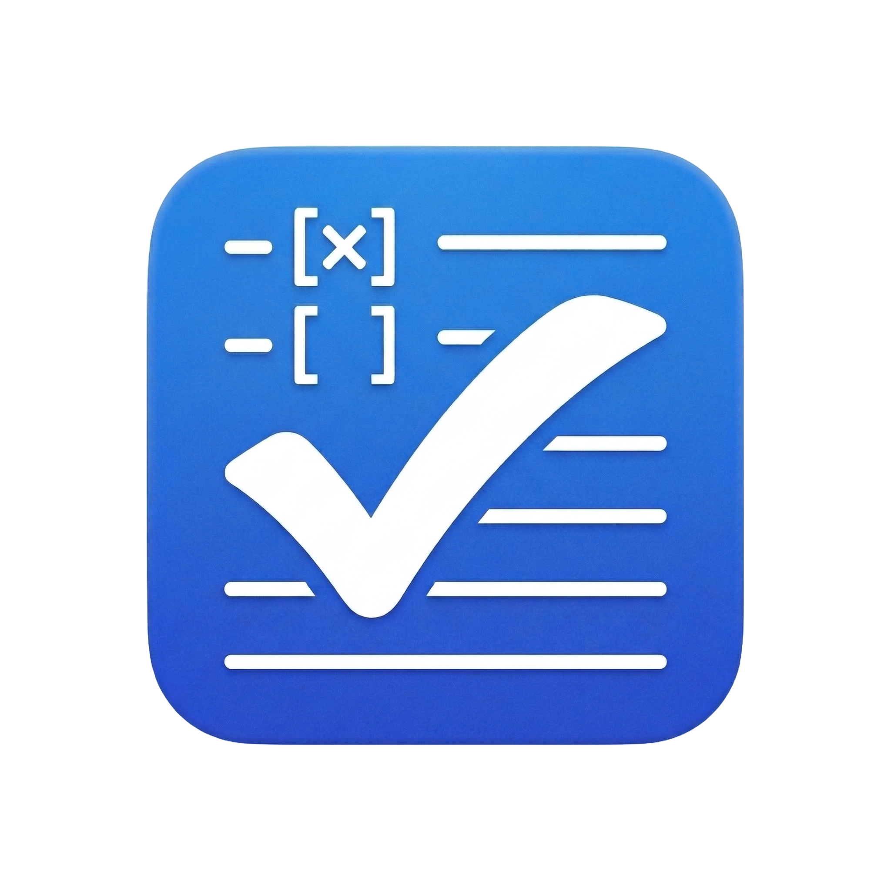
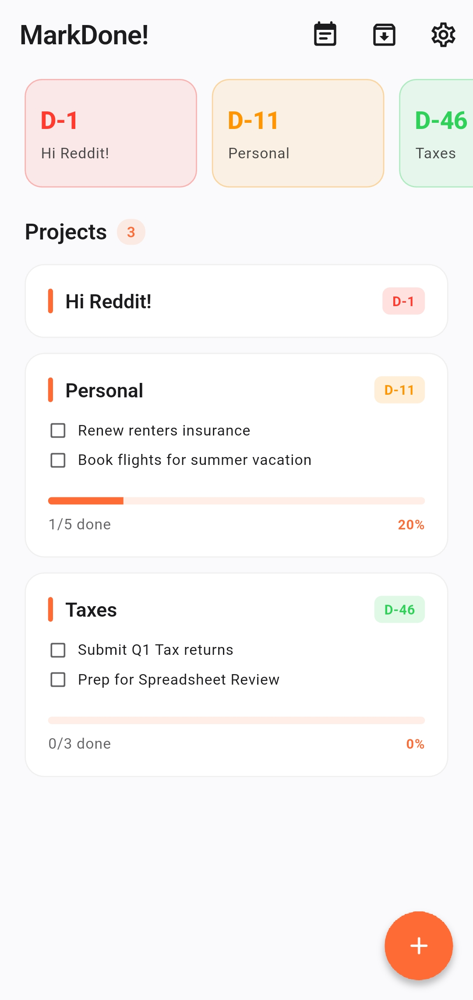
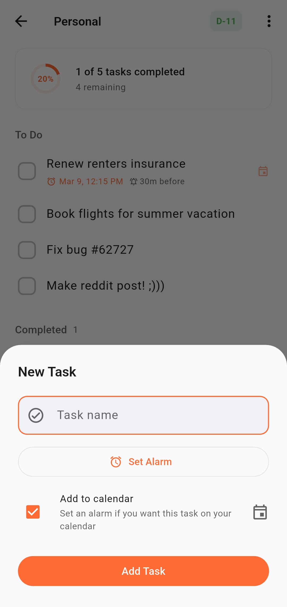
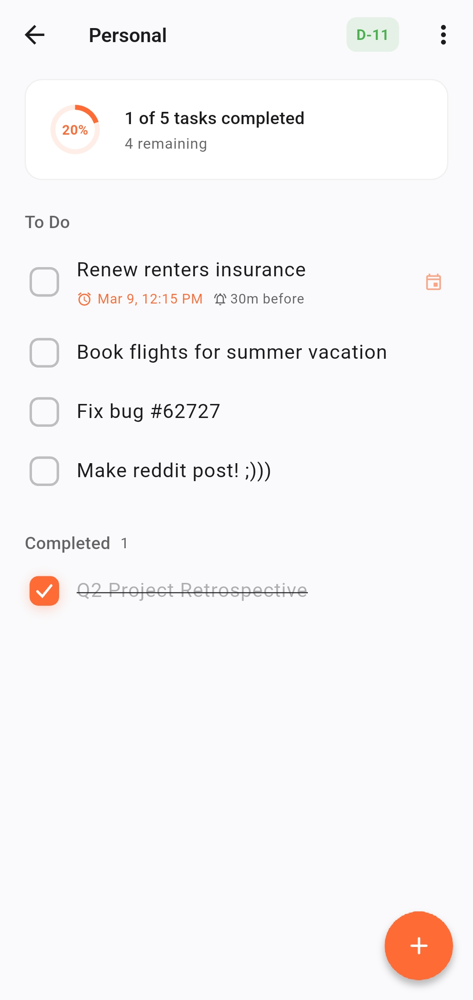
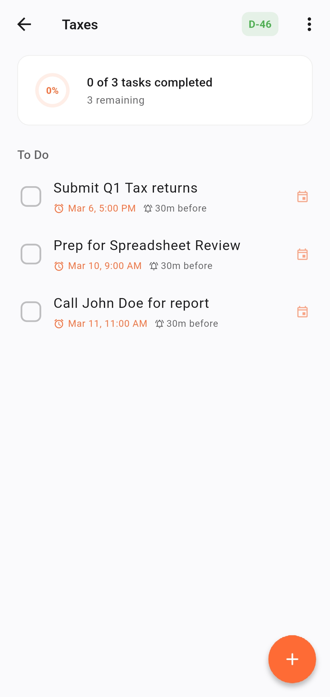
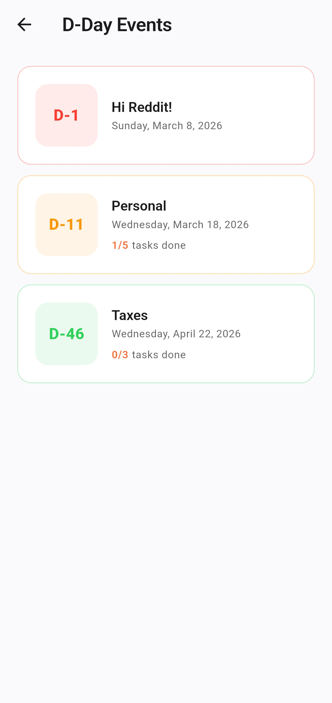
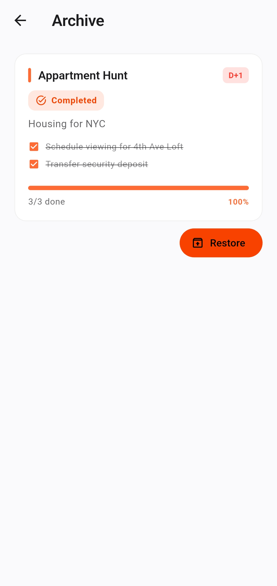
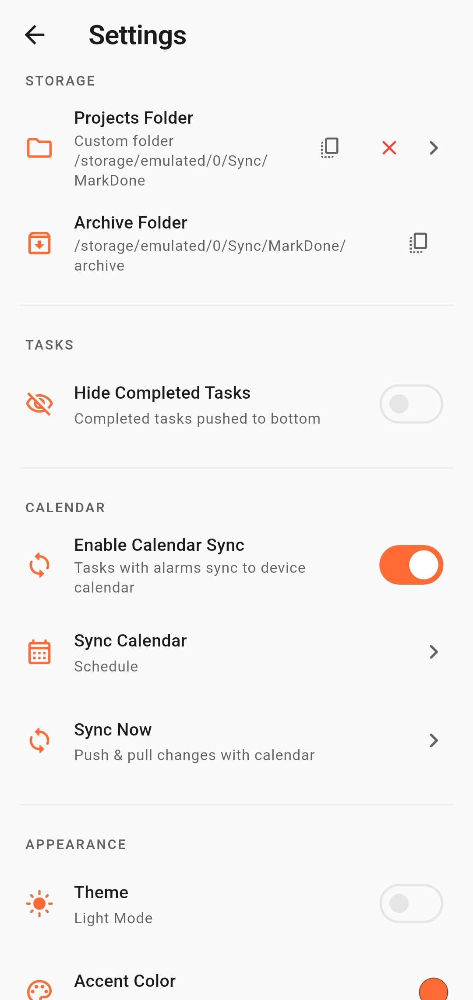

<p align="center">
	
</p>

<h1 align="center">MarkDone!</h1>

<p align="center">
	<a href="https://github.com/udaymehta/markdone/releases/latest">
		
	</a>
	<a href="https://github.com/udaymehta/markdone/releases/latest">
		
	</a>
</p>

The todo app for people who are tired of todo apps acting like they invented writing things down.

## What this thing actually is

`MarkDone!` is a local-first task app built with Flutter that stores projects as plain old Markdown files.

Not a mystery database.
Not some cloud first productivity cult.
Not “minimal” in the fake way where the app looks clean but somehow can’t do anything useful.

Each project is a `.md` file with YAML frontmatter for project-level stuff and hidden HTML comments for task state/metadata. That means:

- Your tasks live in Markdown files
- They stay on your device
- They are easy to move, back up, sync, git, hoard, or throw into an Obsidian vault
- You are not locked into some “trust us bro” SQLite blob

So yeah, this is basically a task app that respects the radical concept of **your files being your files**.

## Why this app exists

Because a lot of task apps are annoying in their own special ways.

- some are too minimal and then immediately fall apart when you want one real feature
- some are bloated productivity casinos
- some trap your stuff in proprietary junk
- some are great for notes, but not great as an actual task/reminder system

This exists because:

- Notion is not where I want my task brain to live
- Todoist is proprietary and I’m not trying to rent my checkboxes forever
- Obsidian is great for notes and knowledge stuff, but task notifications/reminders are not really its strong suit

So the idea here was simple: use Markdown as the source of truth, keep it local, make it portable, and still have actual app features like reminders, D-Day tracking, archive, and calendar sync.

## Screenshots

<table>
	<tr>
		<td align="center">
			<a href="assets/screenshots/homepage.jpg">
				
			</a>
			<br />
			<strong>Home</strong>
		</td>
		<td align="center">
			<a href="assets/screenshots/task_create.jpg">
				
			</a>
			<br />
			<strong>Create Task</strong>
		</td>
	</tr>
	<tr>
		<td align="center">
			<a href="assets/screenshots/todo_personal.jpg">
				
			</a>
			<br />
			<strong>Personal Project</strong>
		</td>
		<td align="center">
			<a href="assets/screenshots/todo_taxes.jpg">
				
			</a>
			<br />
			<strong>Project Tasks</strong>
		</td>
	</tr>
	<tr>
		<td align="center">
			<a href="assets/screenshots/dday.jpg">
				
			</a>
			<br />
			<strong>D-Day</strong>
		</td>
		<td align="center">
			<a href="assets/screenshots/archive.jpg">
				
			</a>
			<br />
			<strong>Archive</strong>
		</td>
	</tr>
	<tr>
		<td align="center" colspan="2">
			<a href="assets/screenshots/settings.jpg">
				
			</a>
			<br />
			<strong>Settings</strong>
		</td>
	</tr>
</table>

Click any screenshot to view it full size.

## Install

### Android

Download the latest APK from:

<a href="https://github.com/udaymehta/markdone/releases/latest">
    
</a>

## Features

- local-first Markdown task storage
- project files you can open and edit outside the app
- optional custom folder, including an Obsidian-friendly one
- hidden metadata in HTML comments so the Markdown stays usable
- reminders / local notifications
- D-Day project tracking
- archive support
- optional calendar sync
- dark mode and accent color customization because default boring is a disease

## How the files work and stored

Projects are stored as Markdown files.

Example File:

```md
---
title: Ship something
created: 2026-03-06
dday: 2026-03-20
description: stop overthinking, start shipping
sync_calendar: true
---

- [ ] finish feature <!-- {"alarm":"2026-03-10T09:00:00.000","reminder":"1d"} -->
- [x] stop pretending another app will fix my life
```

The file is still Markdown.
The extra app-only stuff is tucked away in HTML comments.
Portable, inspectable, no nonsense.

## Building locally

You need the usual Flutter setup first. If Flutter itself is not installed, this repo is obviously not going to magically compile out of pure vibes.

### 1. Get Flutter dependencies

```bash
flutter pub get
```

### 2. Build the Android APK

```bash
flutter build apk --release
```

### 3. Grab the APK

The built APK should end up here:

`build/app/outputs/flutter-apk/app-release.apk`

Install that on your device and you’re done.

If you want debug builds or want to run it directly from your machine, do the normal Flutter thing.

## Storage

By default, the app stores Markdown files locally in a `markdone` folder.

You can also point it at a custom folder, which is the whole point if you want your tasks living somewhere you already use, like an Obsidian vault.

## Disclaimer

Yes, a lot of the code in this repo was written with AI help.

This was a personal project for my own use case. It does what I wanted, it works for me, and I’m not going to perform fake artisanal hand crafted purity rituals over that.

Still sharing it in case somebody else wants a weird little Markdown powered task app that refuses to worship proprietary nonsense. Yes that is me.
