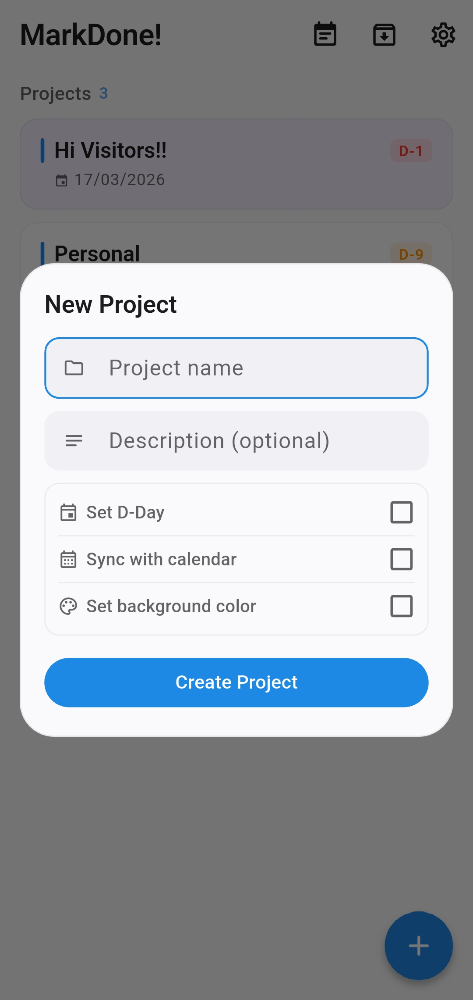

<p align="center">
	
</p>

<h1 align="center">MarkDone!</h1>

<p align="center">
	<a href="https://github.com/udaymehta/markdone/releases/latest">
		
	</a>
	<a href="https://github.com/udaymehta/markdone/releases/latest">
		
	</a>
</p>

A local-first task manager built with Flutter that stores everything as plain Markdown files.

## What it does

Each project is a `.md` file with YAML frontmatter for project settings and HTML comments for task metadata. Your data stays on your device in files you can read, edit, move, or sync however you want.

- Projects stored as readable Markdown files
- No cloud accounts, no proprietary databases
- Works alongside Obsidian, git, Syncthing, or anything that handles files
- Task metadata is tucked into HTML comments so the Markdown stays clean

## Screenshots

<table>
	<tr>
		<td align="center">
			<a href="assets/screenshots/homepage.jpg">
				
			</a>
			<br />
			<strong>Home</strong>
		</td>
		<td align="center">
			<a href="assets/screenshots/task_create.jpg">
				
			</a>
			<br />
			<strong>Create Task</strong>
		</td>
	</tr>
	<tr>
		<td align="center">
			<a href="assets/screenshots/todo_personal.jpg">
				
			</a>
			<br />
			<strong>Personal Project</strong>
		</td>
		<td align="center">
			<a href="assets/screenshots/todo_taxes.jpg">
				
			</a>
			<br />
			<strong>Project Tasks</strong>
		</td>
	</tr>
	<tr>
		<td align="center">
			<a href="assets/screenshots/dday.jpg">
				
			</a>
			<br />
			<strong>D-Day</strong>
		</td>
		<td align="center">
			<a href="assets/screenshots/archive.jpg">
				
			</a>
			<br />
			<strong>Archive</strong>
		</td>
	</tr>
	<tr>
		<td align="center">
			<a href="assets/screenshots/project_create.jpg">
				
			</a>
			<br />
			<strong>Project Create</strong>
		</td>
		<td align="center">
			<a href="assets/screenshots/settings.jpg">
				
			</a>
			<br />
			<strong>Settings</strong>
		</td>
	</tr>
</table>

Click any screenshot to view it full size.

## Install

### Android

Download the latest APK from:

<a href="https://github.com/udaymehta/markdone/releases/latest">
    
</a>

## Features

- **Markdown storage** — projects are `.md` files with YAML frontmatter, editable in any text editor
- **Custom reminders** — local notifications with flexible scheduling
- **Recurring tasks** — configurable repeat intervals stored in Markdown metadata
- **D-Day tracking** — countdown badges on projects with a dedicated D-Day overview screen
- **Drag-to-reorder** — manual task ordering with persistent sort positions
- **Swipe gestures** — swipe right to complete, swipe left to delete
- **Project background colors** — per-project color tinting on both the detail page and home cards
- **Archive** — completed projects can be archived and restored
- **Calendar sync** — optional integration with device calendar
- **Custom folder** — point to any directory, including an Obsidian vault
- **Font size scaling** — adjustable global text size (0.8x to 1.4x)
- **Dark mode** and accent color customization

## File format

Projects are stored as Markdown files with this structure:

```md
---
title: Ship something
created: 2026-03-06
dday: 2026-03-20
description: stop overthinking, start shipping
bg_color: "#33ff6b35"
sync_calendar: true
---

- [ ] finish feature <!-- {"id":"0d6bc622","alarm":"2026-03-10T09:00:00.000","reminder":"2w","recurrence":{"frequency":"daily","interval":3}} -->
- [x] write tests
```

The YAML frontmatter holds project-level settings. Each task is a standard Markdown checkbox. App-specific metadata (IDs, alarms, recurrence) lives in HTML comments after each task line, so the file remains valid Markdown.

## Building locally

Requires a working [Flutter](https://docs.flutter.dev/get-started/install) installation.

### 1. Get dependencies

```bash
flutter pub get
```

### 2. Build the APK

```bash
flutter build apk --release
```

### 3. Install

The built APK will be at:

`build/app/outputs/flutter-apk/app-release.apk`

For debug builds, use `flutter run` as usual.

## Storage

By default, files are stored in a local `markdone` folder. You can change this to any directory in Settings — useful if you want your tasks inside an Obsidian vault or a synced folder.

## Disclaimer

A good portion of the code in this project was written with AI assistance. This started as a personal tool for my own workflow. Sharing it in case it's useful to someone else.
