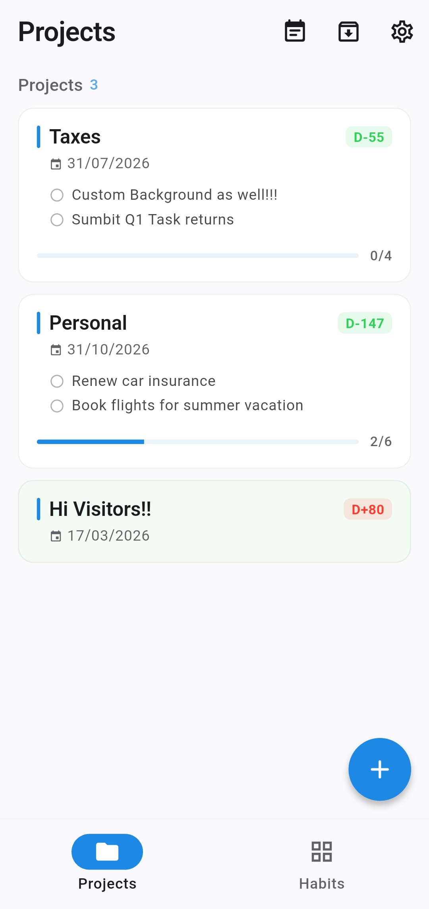
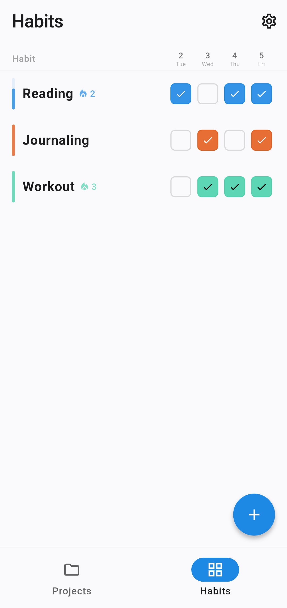

<p align="center">
	
</p>

<h1 align="center">MarkDone!</h1>

<p align="center">
	<a href="https://github.com/atanhx/markdone/releases/latest">
		/markdone?display_name=tag&label=latest%20release" alt="Latest release" />
	</a>
	<a href="https://github.com/atanhx/markdone/releases/latest">
		
	</a>
</p>

A local-first task manager with habit tracking, built with Flutter. Projects and habits are stored as plain Markdown files and CSV — no cloud, no proprietary databases.

## What it does

Each project is a `.md` file with YAML frontmatter for project settings and HTML comments for task metadata. Habits are stored in a plain CSV file with completion dates, reminders, and custom notification messages. Your data stays on your device in files you can read, edit, move, or sync however you want.

## Screenshots

<table>
	<tr>
		<td align="center">
			<a href="assets/screenshots/demo_projects.jpg">
				
			</a>
			<br />
			<strong>Projects</strong>
		</td>
		<td align="center">
			<a href="assets/screenshots/demo_habits_list.jpg">
				
			</a>
			<br />
			<strong>Habits</strong>
		</td>
	</tr>
</table>

#### Check [assets/screenshots](./assets/screenshots) folder more!!!

## Install

### Android

Download the latest APK from:

<a href="https://github.com/atanhx/markdone/releases/latest">
    
</a>

## Features

- **Markdown storage** — projects are `.md` files with YAML frontmatter, editable in any text editor
- **Habit tracking** — daily check-in heatmaps, weekly trend charts, and streak counters
- **Habit notifications** — configurable daily reminders with custom notification messages and Done/Not Done actions
- **Long-press habit reorder** — drag to reorder habits on the habits screen
- **Custom reminders** — local notifications with flexible scheduling
- **Recurring tasks** — configurable repeat intervals stored in Markdown metadata
- **D-Day tracking** — countdown badges on projects with a dedicated D-Day overview screen
- **Drag-to-reorder** — manual task ordering with persistent sort positions
- **Swipe gestures** — swipe right to complete, swipe left to delete
- **Project background colors** — per-project color tinting on both the detail page and home cards
- **Archive** — completed projects can be archived and restored
- **Calendar sync** — optional integration with device calendar
- **Custom folder** — point to any directory, including an Obsidian vault
- **Font size scaling** — adjustable global text size (0.8x to 1.4x)
- **Dark mode** (including AMOLED pure-black) and accent color customization

## File format

Projects are stored as Markdown files with this structure:

```md
---
title: Ship something
created: 2026-03-06
dday: 2026-03-20
description: stop overthinking, start shipping
bg_color: "#33ff6b35"
sync_calendar: true
---

- [ ] finish feature <!-- {"id":"0d6bc622","alarm":"2026-03-10T09:00:00.000","reminder":"2w","recurrence":{"frequency":"daily","interval":3}} -->
- [x] write tests
```

The YAML frontmatter holds project-level settings. Each task is a standard Markdown checkbox. App-specific metadata (IDs, alarms, recurrence) lives in HTML comments after each task line, so the file remains valid Markdown.

Habits are stored in a separate CSV file with columns for name, color, reminder settings, notification message, sort order, and daily completion dates.

## Building locally

Requires a working [Flutter](https://docs.flutter.dev/get-started/install) installation.

### 1. Get dependencies

```bash
flutter pub get
```

### 2. Build the APK

```bash
flutter build apk --release --split-per-abi --obfuscate --split-debug-info=build/app/outputs/symbols
```

This produces three split APKs (`arm64-v8a`, `armeabi-v7a`, `x86_64`) in `build/app/outputs/flutter-apk/`.

### 3. Install

Install the APK that matches your device's architecture. Most modern Android phones use `arm64-v8a`.

For debug builds, use `flutter run` as usual.

## Storage

By default, files are stored in a local `markdone` folder. You can change this to any directory in Settings — useful if you want your tasks inside an Obsidian vault or a synced folder.

## Disclaimer

A good portion (almost all?) of the code in this project was written with AI assistance. This started as a personal tool for my own workflow. Sharing it in case it's useful to someone else.
